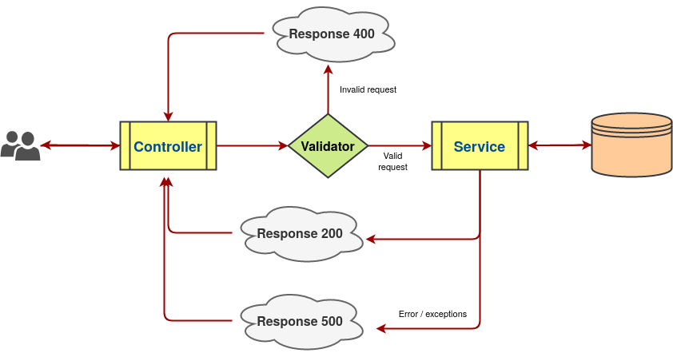

<!-- PROJECT LOGO -->
<br />
<p align="center">
  <a href="https://github.com/Sheldelraze/flask-api-template">
    
  </a>

  <h3 align="center">Flask API template</h3>

  <p align="center">
    An awesome Flask template to jumpstart your projects!
  </p>
</p>


<!-- TABLE OF CONTENTS -->
## Table of Contents

* [About the Project](#about-the-project)
* [Getting Started](#getting-started)
  * [Prerequisites](#prerequisites)
  * [Installation](#installation)
* [Main components](#main-components)
* [Others](#others)
  * [Logging](#logging)
  * [Using Singleton metaclass](#using-singleton-metaclass)
  * [Code formatter](#code-formatter)
  * [Cache](#cache)
  * [API docs generator](#api-docs-generator)
  * [Code docs generator](#code-docs-generator)
  * [Unittest (recommended)](#unittest-recommended)
  * [CI/CD](#ci_cd)
  * [gRPC](#grpc)
* [Roadmap](#roadmap)
* [Contributing](#contributing)
* [License](#license)

<!-- GETTING STARTED -->
## About the Project
This project is a template for Flask API, featuring:
- MVC-like structure
- Customized HTTP response template for faster coding
- Logging management: default to stdout, file and [Graylog](https://www.graylog.org/) (optinal)
- Some utility for optimization: customize memory limited [LRU cache](https://docs.python.org/3/library/functools.html#functools.lru_cache), [Singleton](https://en.wikipedia.org/wiki/Singleton_pattern) metaclass, decorator for function timing,...
- API docs generator ([Flasgger](https://github.com/flasgger/flasgger)) + code document generator
- Unittest with [pytest](https://docs.pytest.org/en/stable/)
- CI / CD with [Jenkins](https://www.jenkins.io/) (coming soon)
- [gRPC](https://grpc.io/docs/what-is-grpc/introduction/) (coming soon)

## Getting Started
### Prerequisites

This project works best with Python >= 3.6, for more instruction on how to install , visit [here](http://ubuntuhandbook.org/index.php/2017/07/install-python-3-6-1-in-ubuntu-16-04-lts/)


### Installation

1. Clone the repo
```sh
git clone https://github.com/Sheldelraze/flask-api-template.git
```
2. Install dependencies
```sh
pip3 install -r requirements.txt
```
3. Run server
```sh
python3 server.py
```

4. Call example `GET` request (more details explain later)
```sh
curl "http://localhost:3412/sample?params_one=1&params_two=2&event_timestamp=123123&user_id=1"
```
or `POST` request
```sh
curl -X POST "http://localhost:3412/sample" -H  "accept: application/json" -H  "Content-Type: application/json" -d "{  \"event_timestamp\": 0,  \"params_four\": \"string\",  \"params_three\": 0,  \"user_id\": \"string\"}"
```
  API document at: http://localhost:3412/apidocs

## Main components
<div align="center">
    
</div>
If you are familiar with MVC patern, this should be fairly simple. Here I will show the nessesary steps which I used to build this template.

### Create a `service` class
In micro-service architecture, each service should handle only 1 main functions, however when we translating the verbose requirements into code we usually break that function into smaller components, so when I say `service` class I mean class representing each component, not the service as a whole.

In this template, I already create a `BaseService` class which contains some utility properties (DB connector, logging, ...), therefore any new `service` class should inherit from it.

```python
class SampleService(base_service.BaseService, metaclass=singleton.Singleton):
    def __init__(self):
        super().__init__()

    def get_sample(self, user_id: str, event_timestamp: float, params_one: str, params_two: int) -> dict:
        return {"question": "What is love?"}

    def post_sample(self, user_id: str, event_timestamp: float, params_three: int, params_four: int) -> dict:
        return {"answer": "Baby don't hurt me..."}
```
This sample contain 2 method for a `GET` and `POST` request which requires some (example) parameters

### Create a `validator` class
Normally we will create a `controller` class to call the methods from the previous `service` class. However before that we should build a validator for the API parameter (you can skip this but for production environment this is highly recommended)

Here is one sample using library [mashmallow](https://pypi.org/project/marshmallow/) (remember to inherit the `base_validator.BaseSchema` class)
```python
class GetSampleSchema(base_validator.BaseSchema):
    class Meta:
        unknown = EXCLUDE  # ignore redundant field
    params_one = fields.Str(required=True, validate=not_blank)
    params_two = fields.Int(required=True)
```

Then after that if some parameter is missing or invalid the response will be:
```json
{
   "result" : [],
   "data" : {
      "params_two" : [
         "Missing data for required field."
      ]
   },
   "message" : {
      "error_code" : 10002,
      "internalMessage" : "Invalid request!",
      "success" : false
   }
}
```

You can check out [sample_validator.py](https://github.com/Sheldelraze/flask-api-template/blob/master/controller/validator/sample_validator.py) and [base_validator.py](https://github.com/Sheldelraze/flask-api-template/blob/master/controller/validator/base_validator.py) and for more information

### Create a `controller` class
Technically in this example I did not write it as class 🤪 but you still can (see [here](https://blog.miguelgrinberg.com/post/designing-a-restful-api-using-flask-restful)). Anyway the rest is quite simple, just call the validator to parse the parameter from incoming request for us and use it to call the service method.

```python
get_sample_validator = sample_validator.GetSampleSchema(unknown=EXCLUDE)

@sample_app.route("/sample", methods=["GET"])
def get_practice_sample():
    args = get_sample_validator.load(flask.request.args)
    data, time_elapsed = s_service.get_sample(**args)
    return make_response(data, time_elapsed)
```

Only need 3 lines for a `GET` request and [4 lines](https://github.com/Sheldelraze/flask-api-template/blob/master/controller/sample_controller.py#L41) for a `POST` request!

## Others
### Logging
Just use `get_logger` from [common_util.py](https://github.com/Sheldelraze/flask-api-template/blob/master/helper/common_util.py), there are 3 default handle: `stoudt`, `file` and `graylog` (if `SERVICE_GRAYLOG_IP` is set in [config.py](https://github.com/Sheldelraze/flask-api-template/blob/master/config.py)). For example:

```python
error_logger = common_util.get_logger("error", False)
```
Then 
```python
error_logger.error(json.dumps(data))
```

### Using Singleton metaclass
Singleton patern in simple term is when we  instantiate only 1 instance of a single class, that means if we try to create another instance, it will be refered back to the first one. 

Usage is really simple: declare a class's metaclass to `Singleton`:

```python
class SampleService(base_service.BaseService, metaclass=singleton.Singleton):
  ...
```
### Cache
When we need to call a function multiple times but the responses don't change at all, consider using cache to save times and CPU usage at the cost of RAM.

Example:
```python
from helper import cache

@cache.lru_cache(use_memory_up_to=config.CACHE_MAX_SIZE)
def get_quiz_detail(quiz_id: str):
    return mongo.find_one({"_id": quiz_id})

quiz = get_quiz_detail(quiz_id='q10023')
```
### Code formatter

### API docs generator

### Code docs generator

### Unittest (recommended)

### CI/CD

### gRPC

<!-- ROADMAP -->
## Roadmap

See the [open issues](https://github.com/Sheldelraze/flask-api-template/issues) for a list of proposed features (and known issues).

<!-- CONTRIBUTING -->
## Contributing

Contributions are what make the open source community such an amazing place to be learn, inspire, and create. Any contributions you make are **greatly appreciated**.

1. Fork the Project
2. Create your Feature Branch (`git checkout -b feature/AmazingFeature`)
3. Commit your Changes (`git commit -m 'Add some AmazingFeature'`)
4. Push to the Branch (`git push origin feature/AmazingFeature`)
5. Open a Pull Request


<!-- LICENSE -->
## License

Distributed under the Unlicense License. See [LICENSE](https://github.com/Sheldelraze/flask-api-template/blob/master/LICENSE) for more information.


